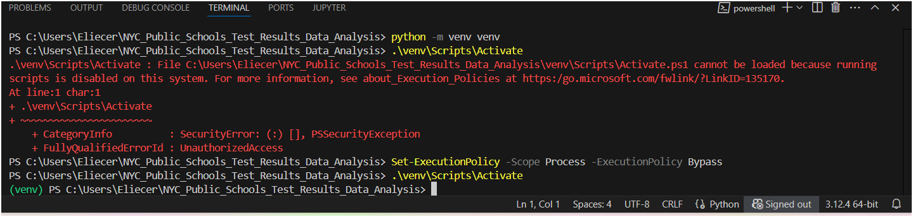
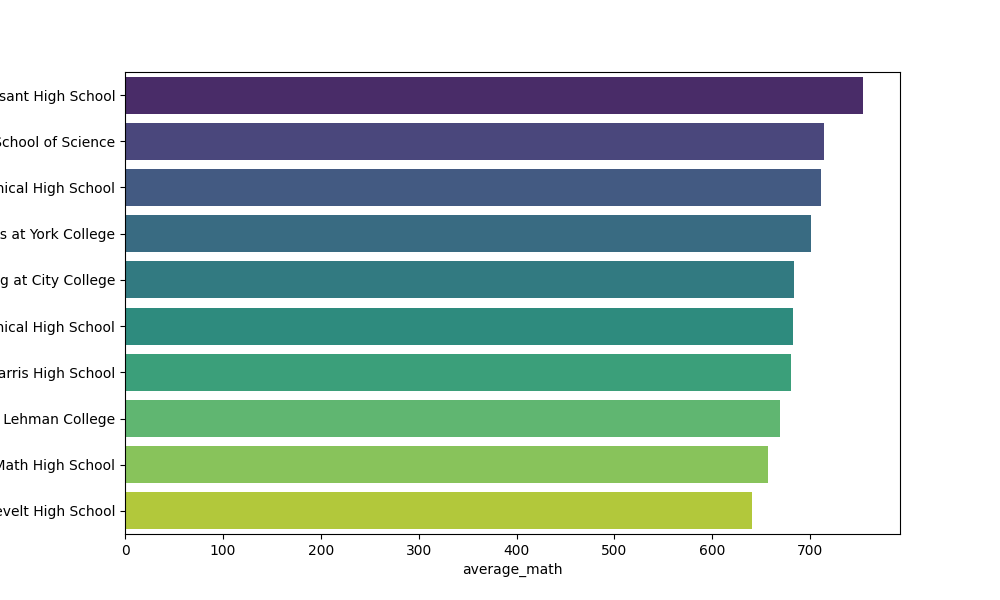
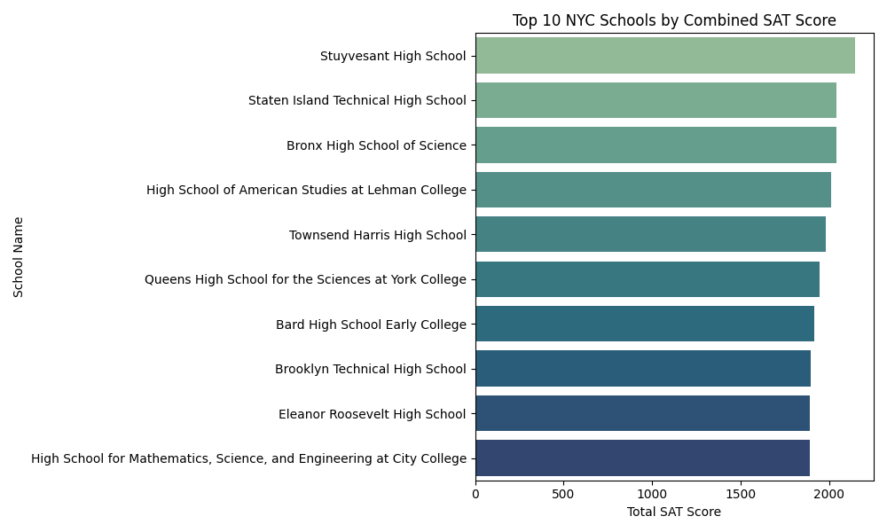
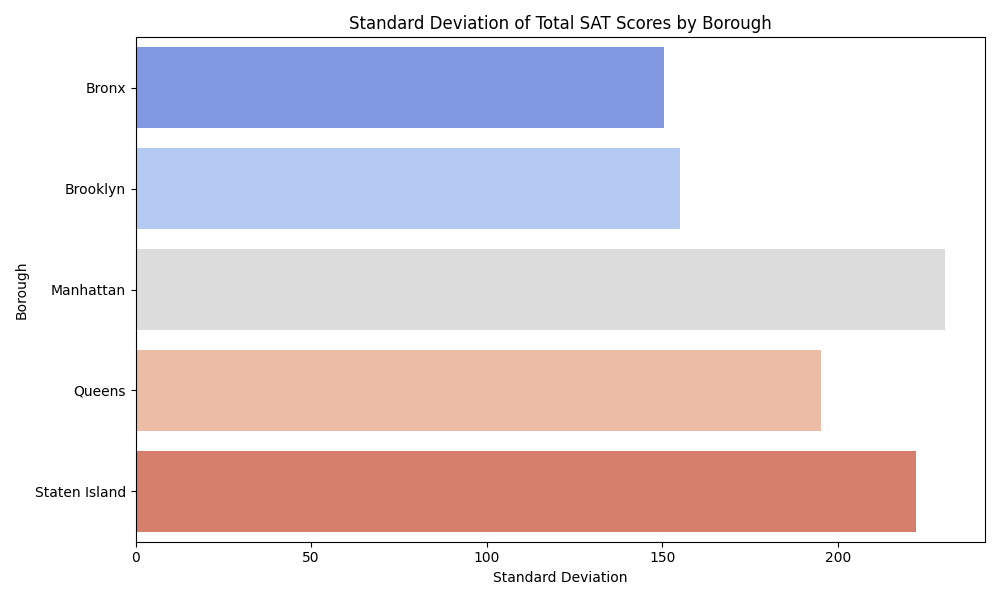

<!DOCTYPE html>
<html lang="en">

</head>
<body>
  <h1>NYC Public Schools Test Results – Exploratory Data Analysis</h1>

  <h2>Project Overview</h2>
  
This project analyzes standardized test results from New York City public schools. It includes exploratory data analysis and visualization using Python libraries such as pandas, matplotlib, and seaborn. The goal is to uncover patterns in student performance across boroughs, grades, and demographic groups.

  <h2>Contents</h2>
  
This repository is organized as follows:

  <pre><code># NYC_Public_Schools_Test_Results_Data_Analysis/
├── data/                 # Raw dataset(s)
│   └── schools.csv       # Main dataset used in analysis
├── notebooks/            # Jupyter notebooks for EDA and visualization
│   └── images            # Folder containing plots and graphics
│   └── exploratory_analysis.ipynb  # Main notebook
│   └── test              # Temporary or test notebooks
├── src/                  # Python scripts for modularized functions
│   ├── __init__.py       # Package initializer
│   ├── load_data.py      # Functions to load and validate datasets
│   ├── clean_data.py     # Data cleaning and preprocessing
│   ├── analyze.py        # EDA and summary statistics functions
│   ├── visualize.py      # Plotting functions using seaborn/matplotlib
│   └── utils.py          # Utility functions (e.g., path management)
├── main.py               # Script to orchestrate full analysis
├── requirements.txt      # List of dependencies
└── README.txt            # This README file
</code></pre>

  <h2>Data Instructions</h2>
  <ol>
    <li>Visit <a href="https://opendata.cityofnewyork.us/">NYC Open Data portal</a></li>
    <li>Search and download relevant datasets (e.g., test scores)</li>
    <li>Move the downloaded CSV files into the <code>data/</code> directory</li>
  </ol>
  <pre><code>mkdir -p data/
mv ~/Downloads/*****.csv data/</code></pre>

  <h2>Data Description</h2>
  
The <code>schools.csv</code> file includes test results and school metadata such as:

  <ul>
    <li><code>school_id</code> – Unique school identifier</li>
    <li><code>district</code> – School district number</li>
    <li><code>math_score</code> – Average math test score</li>
    <li><code>reading_score</code> – Average reading test score</li>
    <li><code>attendance_rate</code> – Percentage of students attending school annually</li>
  </ul>

  <h2>Installation Steps</h2>
  <ol class="steps">
    <li><strong>Clone the repository:</strong>
      <pre><code>git clone https://github.com/elicasagui/NYC_Public_Schools_Test_Results_Data_Analysis.git
cd NYC_Public_Schools_Test_Results_Data_Analysis</code></pre>
    </li>
    <li><strong>Create and activate a virtual environment:</strong>
      <pre><code>python -m venv venv</code></pre>
      
<em>On Windows:</em>

      <pre><code>.\venv\Scripts\Activate</code></pre>
      
<em>On macOS/Linux:</em>

      <pre><code>source venv/bin/activate</code></pre>
    </li>
    <li><strong>Fix PowerShell execution policy (if needed):</strong>
      
Open PowerShell as Administrator and run:

      <pre><code>Set-ExecutionPolicy -Scope Process -ExecutionPolicy Bypass</code></pre>
      
Then activate your virtual environment again:

      <pre><code>.\venv\Scripts\Activate</code></pre>
         

    
  

    </li>
    <li><strong>Install dependencies:</strong>
      <pre><code>pip install -r requirements.txt</code></pre>
    </li>
    <li><strong>Run main script:</strong>
      <pre><code>python main.py</code></pre>
    </li>
    <li><strong>Launch Jupyter Notebook:</strong>
      <pre><code>jupyter notebook</code></pre>
    </li>
  </ol>

  <h2>Project Questions</h2>
  <ul>
    <li>Which NYC schools have the best math results?</li>
    <li>What are the top 10 performing schools based on the combined SAT scores?</li>
    <li>Which borough has the largest standard deviation in SAT scores?</li>
  </ul>

  <h2>Key Insights</h2>
  <table border="1">
    <tr>
      <th>Insight ID</th>
      <th>Description</th>
      <th>Visualization</th>
    </tr>
    <tr>
      <td>1</td>
      <td>Best-performing NYC schools in math</td>
      <td>
        

          
        

      </td>
    </tr>
    <tr>
      <td>2</td>
      <td>Top 10 schools by combined SAT scores</td>
      <td>
        

          
        

      </td>
    </tr>
    <tr>
      <td>3</td>
      <td>Borough with highest SAT score deviation</td>
      <td>
        

          
        

      </td>
    </tr>
  </table>

  
See full analysis in <a href="notebooks/exploratory_analysis.ipynb">exploratory_analysis.ipynb</a>.

  <h2>Running Tests</h2>
  
Ensure <code>pytest</code> is installed and run:

  <pre><code>pip install pytest
pytest tests/</code></pre>

  <h2>Dependencies</h2>
  <ul>
    <li>Python</li>
    <li>pandas</li>
    <li>numpy</li>
    <li>matplotlib</li>
    <li>seaborn</li>
    <li>jupyter</li>
  </ul>

  <h2>License</h2>
  
This project was developed during a DataCamp data science course.

  <h2>Created by</h2>
  

    Eliecer Castro 
    Data Scientist 
    GitHub link: <a href="https://github.com/elicasagui/NYC_Public_Schools_Test_Results_Data_Analysis.git">NYC Schools Repo</a>
  

</body>
</html>

